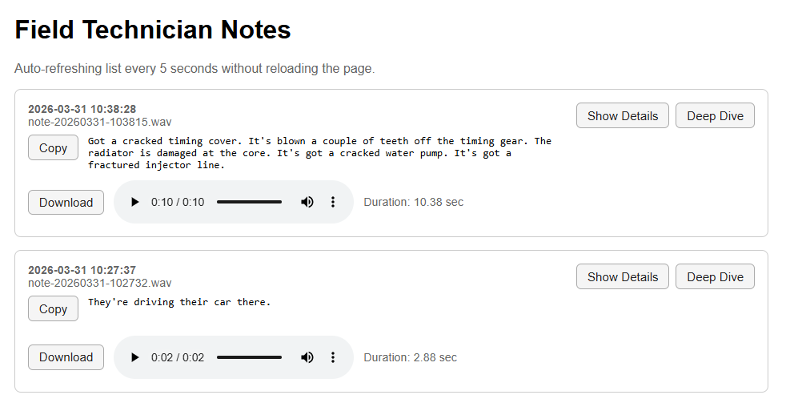
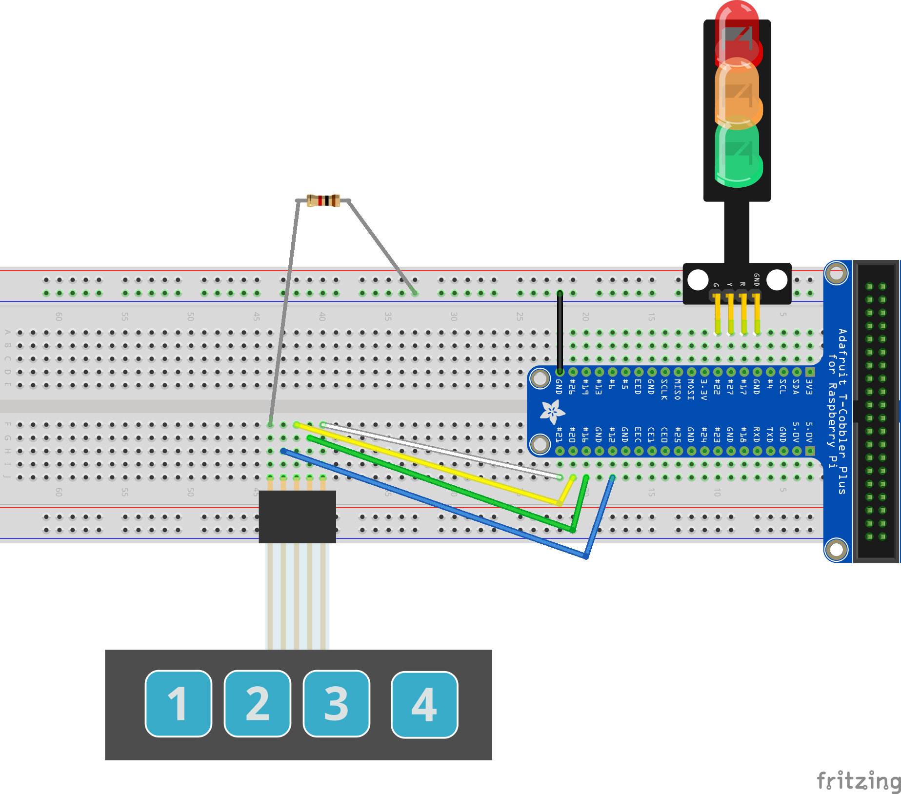

# Field Notes Device (Raspberry Pi + Deepgram)

A field-deployable voice capture and transcription system built on Raspberry Pi with physical controls, LED state feedback, and real-time transcription using Deepgram.

This project is designed as a hands-on demo platform for exploring how unstructured voice input can be captured, processed, and surfaced through a simple UI in near real time.

## Demo



Note:
Since demo was built with a 4x1 membrane switch, all 4 buttons are wired up. This will be useful for WiFi configuration. 

## What It Does

* Push-to-record voice capture (hardware button)
* Stores audio locally as `.wav`
* Sends recordings to Deepgram for transcription
* Displays transcripts and metadata in a web UI
* Uses LEDs to indicate device state
* Hosts a local web interface
* Auto-refreshing UI

## Why This Exists

How do you turn real-world, unstructured voice input into structured, usable data at the edge?

## Initial Hardware Setup

* Raspberry Pi 4
* USB microphone (or webcam mic)
* 3 LEDs (Red, Yellow, Green)
* 3 buttons (Record, Upload, Skip)

Add schematic here later:

```
docs/schematic.png
```

## LED State Mapping

| State      | Red   | Yellow | Green |
| ---------- | ----- | ------ | ----- |
| Idle       | Off   | Off    | On    |
| Recording  | Off   | On     | Off   |
| Processing | On    | Off    | Off   |
| Error      | Blink | Off    | Off   |

## Project Structure

```
app/
  config.py
  deepgram_client.py
  device.py
  gpio_controller.py
  recorder.py
  state_manager.py
  storage.py
  webapp.py
  secrets.py

data/
  recordings/
  transcripts/

.env
.env.example
```

## Setup

```
git clone https://github.com/ericburnsonline/deepgram-field-device-pi.git
cd deepgram-field-device-pi

python3 -m venv venv
source venv/bin/activate

pip install -r requirements.txt

cp .env.example .env
nano .env
```

Add your Deepgram API key:

```
DEEPGRAM_API_KEY=your_key_here
```

## Run

```
python -m app.device
```

## Web UI

```
http://<raspberry-pi-ip>:5000
```

## Audio Device Notes
You need to get the correct device (the plughw:1,0 part) by using the arecord command. Use -l to list devices, then test that you can record. This will be updated once the project switches over to an I2C microphone.

```
arecord -l

arecord -D plughw:1,0 -f S16_LE -r 16000 test.wav
```

## Workflow

1. Press and hold Record
2. Speak
3. Release → saved locally
4. Press Upload
5. Transcription appears in UI

## UI Features

* Auto-refresh without reload
* Copy transcript button
* Download audio
* Audio playback with duration
* Expandable metadata
* Deep Dive JSON view

## Development Approach (Vibe Coding)

This project was built using a vibe coding workflow:

* Rapid AI-assisted iteration
* Focus on working system first
* Structure evolved over time

## Security Notes

* `.env` excluded from version control
* Audio and transcript files are not committed
* Prototype/demo system, not production hardened

## Next Steps

* Highlight low-confidence words - visually flag uncertain words in transcripts
* Switch to I2C Microphone - cleaner integration and is needed for Rasperry Pi Zero 2 W version
* Offline / queued mode - record multiple notes offline, upload later
* Tagging / structuring notes - add tags like "issue" and "inspection"
* Add small OLED Display
* Configuration UI over OLED for WiFi access
* Convert to Raspberry Pi Zero 2 W

## Future Ideas

* Improved retry and error handling
* Device configuration UI
* Authentication for web interface
* Export integrations (Slack, email, etc.)

## License

MIT

## Author

Eric Burns

## Final Thought

Capture → Process → Structure → Present

